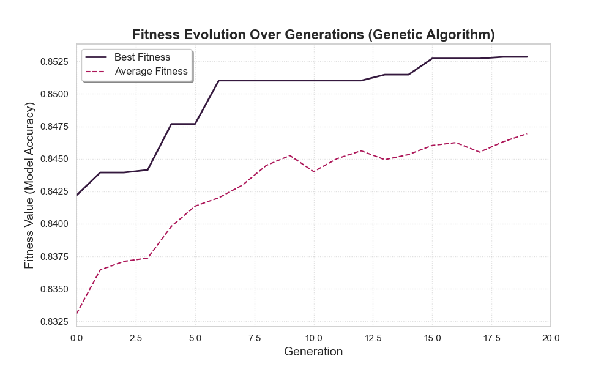

# 🧬 Genetic Algorithm Feature Selection Web App (BIA601 Project_F24)


> An interactive Django-based platform for applying **Genetic Algorithms (GA)** to perform intelligent **feature selection** and compare results with traditional machine learning models.

---

## 📘 Overview

This project was developed as part of the **BIA601 – Intelligent Algorithms (Fall 2024)** course.  
It demonstrates the application of **Genetic Algorithms** in feature selection for machine learning, offering both a **web interface** (Django) and an optional **console mode** for developers.

The system allows users to:
- Upload numeric datasets (`.csv` format)
- Perform **feature selection** using a **custom Genetic Algorithm**
- Compare the optimized results with baseline models:
  - Logistic Regression  
  - Decision Tree  
  - Random Forest  
- Visualize fitness evolution and model performance

> ⚠️ Note: This project only supports datasets with **numerical features**.  
> Categorical columns must be pre-encoded before upload.

---

## 🧩 Features

- 🧠 **Custom-built GA Engine:** Implements crossover, mutation, and selection operators.
- 📊 **Model Comparison Dashboard:** Compare GA-selected features vs. full-feature baselines.
- ⚙️ **Dual Operation Mode:**
  - **Web App**: Interactive Django interface for data upload and visualization.
  - **Console Mode**: For developers to run and modify experiments directly.
- 📈 **Visualization Support:** Fitness evolution plots and accuracy metrics.
- 🗂️ **Extensible Architecture:** Modular Python code structure for further experimentation.

---

## 🧱 Project Structure

```
C:.
│   .gitignore
│   build.sh
│   db.sqlite3
│   License
│   main.py
│   manage.py
│   Procfile
│   README.md
│   render.yaml
│   requirements.txt
│   test_preprocessing_sanity.py
│
├───analysis
│   │   admin.py
│   │   apps.py
│   │   forms.py
│   │   models.py
│   │   tests.py
│   │   urls.py
│   │   views.py
│   │   __init__.py
│   │
│   ├───ga_job_results
│   │   └───repo_default
│   │           fitness_evolution.png
│   │           repo_default_summary.json
│   │
│   ├───ga_processor
│   │       ga_processor.py
│   │       __init__.py
│   │
│   ├───migrations
│   │       __init__.py
│   │
│   └───utils
│           data_loader.py
│           ga_engine.py
│           __init__.py
│
├───bia601_project
│       asgi.py
│       settings.py
│       urls.py
│       wsgi.py
│       __init__.py
│
├───data
│       best_feature_mask.joblib
│       best_ga_model.joblib
│       test.csv
│       train.csv
│
├───src
│   │   baseline_models.py
│   │   data_preprocessing.py
│   │   ga_experiment.py
│   │   __init__.py
│   │
│   ├──ga_feature_select
│      │   fitness.py
│      │   ga_core.py
│      │   operators.py
│      │__ _init__.py
│                   
│
├───static
│   ├───css
│   │       style.css
│   │
│   └───js
│           app.js
│
└───templates
        base.html
        database_link_form.html
        home.html
        repository_results.html
        repository_selection_form.html
        upload_csv_form.html
        upload_dynamic.html
```

---

## ⚙️ Installation & Setup

### 1️⃣ Clone the Repository
```bash
git clone https://github.com/abd-313/BIA601_GA_Feature_Selection
cd BIA601_GA_Feature_Selection
```

### 2️⃣ Create and Activate a Virtual Environment
```bash
python -m venv venv
# On Windows:
venv\Scripts\activate
# On Linux/macOS:
source venv/bin/activate
```

### 3️⃣ Install Dependencies
```bash
pip install -r requirements.txt
```

---

## 🚀 Usage

### ▶️ Option 1: Run the Web Application (Recommended)
```bash
python manage.py runserver
```

Then open your browser at **http://127.0.0.1:8000/**

From there, you can:
- Upload your numeric dataset (`.csv`)
- Alternatively, provide a link to the CSV file
- Specify the **target column name**
- Run the **Genetic Algorithm**
- View model comparisons and results visually

---

### 💻 Option 2: Run via Console (Developer Mode)

You can also execute the experiment directly in the console:
```bash
python main.py
```

> ⚠️ This mode uses the default dataset in the `data/` directory (`train.csv` and `test.csv`).  
> Developers can modify these files and adjust parameters in `main.py` to test other datasets or configurations.

---

## 🧠 How It Works

### 🔹 Genetic Algorithm for Feature Selection
The GA searches for the **optimal subset of features** that balances:
- **High model accuracy**, and  
- **Low feature count** (simpler models)

The **fitness function** is defined as:

`Fitness = (α × Accuracy) - (w × Feature Ratio)`

Where:
- **α (ALPHA)** = 0.9 → Weight for accuracy  
- **w (PENALTY_WEIGHT)** = 0.1 → Weight for feature penalty  

This ensures that models are not only accurate but also efficient in terms of selected features.

### 🔹 Baseline Models
Three classical models are trained and compared against the GA-selected features:
- Logistic Regression  
- Decision Tree Classifier  
- Random Forest Classifier

Each model’s performance is evaluated using accuracy metrics for consistency.

---

## 📊 Example Results

| Model              | Accuracy | Selected Features |
|--------------------|-----------|-------------------|
| Logistic Regression | 0.87 | 56/100 |
| Decision Tree       | 0.89 | 62/100 |
| Random Forest       | 0.92 | 58/100 |
| **GA Optimized**    | **0.94** | **32/100** |

### 📈 Fitness Evolution Plot
Below is an example of the GA's fitness evolution across generations:



---

## 🧪 Requirements

- Python **3.11.9**
- Django **5.2.7**
- See `requirements.txt` for all additional dependencies.

---

## 🌐 Demo

> 🔧 **Deployment Is live for a month from 11/5/2025**  
> Since the deployment is free, it's only available for a short time; therefore, the localhost option is the best choice afterward.

---

## 👥 Authors

Developed by:

- [Bilal Alasha : https://github.com/Bilal-Alasha]  
- [Abdulrahman Suleiman : https://github.com/abd-313]  
- [Jalaa alaswad : https://github.com/jaltarala2-sudo]  
- [Oday : https://github.com/ODAY-43]  
- [mohamad : https://github.com/mohamadib16587-afk]  
- [Mhd mahdi alwis : https://github.com/MhdMahdiAlwis ]  
- [Doha : https://github.com/doha993]

---

## 📜 License

This project is licensed under the [MIT License](LICENSE).

You are free to use, modify, and distribute this software with proper attribution.

---

## 📬 Future Improvements

- Add categorical data preprocessing support  
- Enhance visualization with interactive charts  
- Enable online deployment for demo access  
- Integrate additional evolutionary strategies (e.g., PSO, DE)

---

## 🌟 Acknowledgements

Special thanks to Dr. Issam, professor of **BIA601 Intelligent Algorithms**, for his invaluable guidance and supervision. 

---
